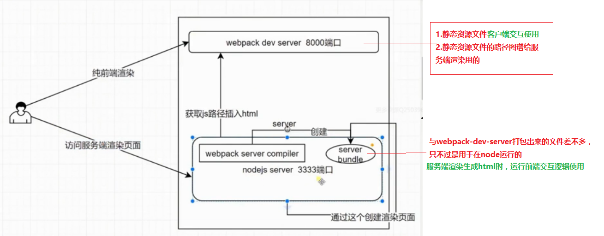

# VUE-SSR

## wepback配置需要说明的地方
1.在开发环境中，想使用热更新，需要安装vue-style-loader,并且替换style-loader，否则css样式无法热更新
```
{
    test: /\.css$/,
    use: [
        {loader: 'vue-style-loader'},//style-loader
        {loader:'css-loader',options:{minimize: false, importLoaders:1}},
        {loader: 'postcss-loader',options:{sourceMap:true, config: {path: path.resolve(__dirname, '../postcss.config.js')} }}
    ]
},
```

2.开发过程中要eslint
eslint
eslint-config-standard
eslint-loader
eslint-plugin-html
eslint-plugin-import
eslint-plugin-node
eslint-plugin-promise
eslint-plugin-standard
```
{
    "extends": "standard",
    plugins: [
        "html"
    ],
    "parser": "babel-eslint"
}
```

3.git commit时自动eslint
> **注意**: 一定要先git init，再install husky
> npm i -D husky
> package.json >  "precommit": "npm run eslint-fix"

4.升级到webpack4
> 先把之前的webpack相关的所有依赖全部uninstall
> 重新安装最新版本，另外还要装webpack-cli
> **注意:** 如果还有提示没到相应的版本 则 xxx@next
```
1.制定环境
const baseConfig = {
    mode: process.env.NODE_ENV || 'production',
}
2.干掉devtool，webpack4在开发环境默认添加
3.干掉CommonsChunkPlugin，换成optimization
//提取公共文件
optimization: {
    splitChunks: {
        chunks: 'all'
    },
    runtimeChunk: true
},
4.去掉entry中vendor
//生成 app.js vendors-app.js runtiome-app.js
```
## vue-router按需加载（提升首页加载速度）
> 1.npm i -S babel-plugin-syntax-dynamic-import
> 2.修改.babelrc
> `"plugins": ["syntax-dynamic-import"]`
> 3.修改routes
> `{ path: '/app', component: () => import('../views/todo/todo.vue') }`

## 进击SSR

> 需要两个webpack 前端webpack(webpack.client.js)和N服务端webpack(webpack.server.js)
> 1.前端: 打包生成纯前端的静态资源
> 2.服务端: 生成server bundle(页面body里面的内容，没有script)来渲染生成html文件
> 流程就是 服务端拿到前端生成的打包的静态资源路径，根据路径获取资源插入到服务端渲染出来的html（数据内容），返回给客户端
> 结果就是: body(serverbundle+资源路径) = html